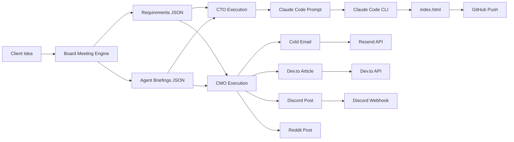

<p align="center">
  <h1 align="center">人間 NINGEN</h1>
  <p align="center"><em>AI Board of Directors That Builds Your Startup</em></p>
</p>

<p align="center">
  
  
  
  
</p>

---

## What is Ningen?

**Ningen** (人間, "human" in Japanese) is an autonomous AI startup execution system. You pitch a startup idea — and four AI executives (CEO, CTO, CMO, COO) hold a real board meeting, debate each other, resolve conflicts, and then **actually build the product and launch it**.

This is not a chatbot. This is not a toy. Ningen's agents:

- 🗣️ **Deliberate** across 3 structured rounds with real disagreements
- 📄 **Produce** a full requirements document, technical spec, and go-to-market plan
- 🔨 **Build** a working web application via Claude Code CLI
- 📢 **Launch** marketing content to Dev.to, Discord, and email via Resend
- 🚀 **Deploy** everything to GitHub automatically

**One idea in → working product + marketing out.**

---

## Architecture

```
┌─────────────────────────────────────────────────────────────────┐
│                        USER INPUT                               │
│                   "I want to build X"                           │
└─────────────────────┬───────────────────────────────────────────┘
                      │
                      ▼
┌─────────────────────────────────────────────────────────────────┐
│                    BOARD MEETING ENGINE                          │
│                   board_meeting.py (1,400 lines)                │
│                                                                 │
│  ┌──────────┐ ┌──────────┐ ┌──────────┐ ┌──────────┐          │
│  │   CEO    │ │   CTO    │ │   CMO    │ │   COO    │          │
│  │ Vision & │ │ Systems  │ │ Customer │ │ Execution│          │
│  │ Momentum │ │ & Risk   │ │ & Market │ │ & Ops    │          │
│  └────┬─────┘ └────┬─────┘ └────┬─────┘ └────┬─────┘          │
│       │             │             │             │               │
│       └─────────────┴─────────────┴─────────────┘               │
│                         │                                       │
│            Round 1: Opening Positions                           │
│            Client Q&A: Clarification                            │
│            Round 2: Reactions & Debate                           │
│            Conflict Detection (keyword + LLM)                   │
│            Round 3: Resolution & Agreements                     │
│            Final Briefings (per-agent mission docs)             │
│            Requirements Document Generation                     │
│                         │                                       │
└─────────────────────────┼───────────────────────────────────────┘
                          │
                ┌─────────┴─────────┐
                ▼                   ▼
┌───────────────────────┐ ┌───────────────────────┐
│   CTO EXECUTION       │ │   CMO EXECUTION       │
│   execute_cto.py      │ │   execute_cmo.py      │
│                       │ │                       │
│ 1. Read requirements  │ │ 1. Read requirements  │
│ 2. GPT-4o → prompt    │ │ 2. GPT-4o → content   │
│ 3. Claude Code builds │ │    • Cold email       │
│    index.html         │ │    • Dev.to article   │
│ 4. Git push to GitHub │ │    • Discord post     │
│                       │ │    • Reddit post      │
└───────────┬───────────┘ │ 3. Save to files      │
            │             │ 4. Publish:            │
            │             │    • Resend API        │
            │             │    • Dev.to API        │
            │             │    • Discord Webhook   │
            │             └───────────┬─────────────┘
            │                         │
            ▼                         ▼
┌─────────────────────────────────────────────────────────────────┐
│                        OUTPUTS                                  │
│                                                                 │
│  outputs/                                                       │
│  ├── <ProjectName>/                                             │
│  │   ├── <ProjectName>_requirements.json   ← full spec          │
│  │   └── <ProjectName>_briefings.json      ← agent missions     │
│  ├── index.html                            ← built product      │
│  ├── cto_claude_prompt.txt                 ← CTO's build prompt │
│  ├── cold_email.md                         ← marketing          │
│  ├── devto_article.md                      ← marketing          │
│  ├── discord_post.md                       ← marketing          │
│  └── reddit_post.md                        ← marketing          │
│                                                                 │
└─────────────────────────────────────────────────────────────────┘
```

---

## Project Structure

```
project-ningen/
│
├── board_meeting.py          # Core engine — 4 AI agents deliberate (1,400 lines)
├── execute_cto.py            # CTO agent — builds product via Claude Code CLI
├── execute_cmo.py            # CMO agent — generates & publishes marketing content
├── main.py                   # Entry point (reserved)
├── requirements.txt          # Python dependencies
├── .env                      # API keys (not committed)
├── .gitignore
│
├── agents/                   # Agent class stubs (future modular agents)
│   ├── __init__.py
│   ├── base_agent.py
│   ├── ceo_agent.py
│   ├── cto_agent.py
│   ├── cmo_agent.py
│   └── coo_agent.py
│
├── dashboard/                # UI layer
│   ├── app.py                # Terminal CLI interface for board meetings
│   └── board_meeting_ui.py   # Gradio web UI (planned)
│
├── integrations/             # External service connectors (planned)
│   ├── __init__.py
│   ├── resend_email.py       # Resend email integration
│   ├── huggingface_deployer.py
│   └── supabase_db.py
│
├── training/                 # GRPO training pipeline (planned)
│   ├── __init__.py
│   └── grpo_trainer.py
│
└── outputs/                  # All generated artifacts
    ├── <ProjectName>/
    │   ├── <ProjectName>_requirements.json
    │   └── <ProjectName>_briefings.json
    ├── index.html
    ├── cto_claude_prompt.txt
    ├── cold_email.md
    ├── devto_article.md
    ├── discord_post.md
    └── reddit_post.md
```

---

## The Four Agents

Each agent has a distinct personality, priorities, and blind spots — creating realistic tension.

| Agent | Role | Personality | Priorities |
|-------|------|-------------|------------|
| **CEO** | Chief Executive Officer | Visionary, impatient, pushes for speed | Momentum, MVP, market timing |
| **CTO** | Chief Technology Officer | Systems thinker, detail-oriented, pushes back on timelines | Technical risk, architecture, feasibility |
| **CMO** | Chief Marketing Officer | Customer-obsessed, anchors to real personas | Target customer, market fit, positioning |
| **COO** | Chief Operating Officer | Realist, tracks execution blockers | Ownership, deadlines, resource capacity |

---

## Meeting Protocol

The board meeting follows a structured 3-round deliberation:

### Round 1 — Opening Positions
Each agent reads the client's idea and states their position. Agents **only identify risks and ask internal questions** — they never prescribe solutions in Round 1. This forces genuine problem understanding before solutioning.

**Speaking order:** CEO → CTO → CMO → COO

Each agent sees all previous agents' positions, creating a building conversation.

### Client Q&A
Each agent generates **one focused clarifying question** for the client:
- CEO asks about vision and success metrics
- CTO asks about technical constraints and existing infrastructure
- CMO asks about target customer and willingness to pay
- COO asks about timeline, budget, and headcount

The client answers all four in one response.

### Round 2 — Reactions
Agents react to each other with real pushback:
- **CEO** reacts to COO's caution — pushes for speed
- **CTO** reacts to CEO's timeline — names specific technical blockers
- **CMO** reacts to CTO — anchors to what the customer actually needs on Day 1
- **COO** identifies what is **still unresolved** after all reactions

### Conflict Detection
The system detects conflicts using **keyword analysis + LLM fallback**:

| Conflict Type | Detection Method |
|---------------|-----------------|
| Timeline | CEO uses speed words + CTO uses caution words |
| Target Customer | CEO/CMO B2B vs B2C keyword mismatch |
| Execution Blockers | COO uses "nobody owns", "unassigned", "missing" |
| Resource Capacity | COO mentions resource limits + CTO has large scope |
| General Alignment | LLM fallback if no keyword conflicts detected |

### Round 3 — Resolution
For each detected conflict, the two involved agents negotiate directly:
1. Agent A proposes a specific compromise (numbers, dates, segments)
2. Agent B responds and must end with `AGREED:` followed by the resolution

All agreements are recorded and fed into the final outputs.

### Final Outputs
After resolution, the system generates:
- **Per-agent mission briefings** (CEO: north star metric, CTO: week-one build, CMO: target customer, COO: execution plan)
- **Requirements document** with product name, tech spec, go-to-market, week-one tasks, resolved conflicts, and open questions

---

## Execution Pipeline

After the board meeting, two execution agents can run independently:

### CTO Execution (`execute_cto.py`)

```
Requirements JSON → GPT-4o-mini → Claude Code Prompt → Claude Code CLI → index.html → Git Push
```

1. Reads the latest board meeting outputs (auto-discovers project subdirectories)
2. Sends requirements to GPT-4o-mini with a CTO system prompt — generates a **pixel-perfect Claude Code prompt**
3. Runs `claude -p <prompt> --dangerously-skip-permissions` in `./outputs`
4. Claude Code builds a complete single-page web app (`index.html`)
5. Commits and pushes to GitHub automatically

### CMO Execution (`execute_cmo.py`)

```
Requirements JSON → GPT-4o-mini → 4 Content Pieces → Publish to 3 Platforms
```

1. Reads requirements + CMO briefing, extracts target customer
2. Generates four distinct marketing pieces via GPT-4o-mini:
   - **Cold email** — personal, specific, targeted at the exact customer persona
   - **Dev.to article** — 500+ word technical article with problem-solution framing
   - **Discord announcement** — punchy launch message with emoji and bullet points
   - **Reddit post** — genuine, non-salesy advice post with natural product mention
3. Saves all content to `outputs/*.md`
4. Publishes to live platforms:
   - **Resend** — sends cold email to subscriber list
   - **Dev.to** — publishes article with tags `[ai, startup, technology]`
   - **Discord** — posts via webhook to announcement channel

---

## Setup

### Prerequisites
- Python 3.9+
- OpenAI API key
- Claude Code CLI (for CTO execution): `npm install -g @anthropic-ai/claude-code`

### Installation

```bash
# Clone
git clone https://github.com/venkateshannabathina/project-ningen.git
cd project-ningen

# Create virtual environment
python3 -m venv venv
source venv/bin/activate

# Install dependencies
pip install -r requirements.txt
```

### Environment Variables

Create a `.env` file in the project root:

```env
# Required
OPENAI_API_KEY=sk-your-openai-key

# For CMO Execution (optional)
RESEND_API_KEY=re_your-resend-key
RESEND_FROM_EMAIL=you@yourdomain.com
RESEND_SUBSCRIBER_EMAILS=user1@example.com,user2@example.com
DEVTO_API_KEY=your-devto-api-key
DISCORD_WEBHOOK_URL=https://discord.com/api/webhooks/...
```

---

## Usage

### 1. Run a Board Meeting

**Terminal mode (direct):**
```bash
python3 board_meeting.py
```

**Dashboard mode (CLI interface):**
```bash
python3 dashboard/app.py
```

Both modes prompt you for a startup idea, run the full 3-round deliberation, and save outputs.

### 2. Build the Product (CTO Agent)

```bash
python3 execute_cto.py
```

Reads the latest board meeting output, generates a Claude Code prompt, builds `index.html`, and pushes to GitHub.

### 3. Launch Marketing (CMO Agent)

```bash
python3 execute_cmo.py
```

Generates all marketing content, saves to files, and publishes to Dev.to, Discord, and Resend.

---

## How Outputs Are Organized

Each board meeting creates a project-specific subdirectory:

```
outputs/
├── TodoMaster_Pro/
│   ├── TodoMaster_Pro_requirements.json
│   └── TodoMaster_Pro_briefings.json
├── CompanionAI_3D/
│   ├── CompanionAI_3D_requirements.json
│   └── CompanionAI_3D_briefings.json
```

The product name is auto-generated by the CEO agent and sanitized into a filesystem-safe slug. Previous runs are never overwritten.

---

## Tech Stack

| Component | Technology |
|-----------|-----------|
| LLM | OpenAI GPT-4o-mini |
| Product Builder | Claude Code CLI |
| Email | Resend API |
| Blog | Dev.to API |
| Announcements | Discord Webhooks |
| UI | Terminal CLI / Gradio (planned) |
| Version Control | GitHub + Hugging Face |
| Language | Python 3.9+ |

---

## Data Flow



---

## Roadmap

- [x] Board meeting engine with 4 agents
- [x] 3-round deliberation protocol
- [x] Conflict detection and resolution
- [x] Per-agent mission briefings
- [x] Requirements document generation
- [x] CTO execution via Claude Code CLI
- [x] CMO multi-platform publishing
- [x] Project-name-based output organization
- [ ] Gradio web dashboard with real-time agent chat
- [ ] GRPO training pipeline for agent personality refinement
- [ ] Supabase integration for persistent meeting history
- [ ] Hugging Face Spaces deployment
- [ ] COO execution agent (project management automation)
- [ ] CEO execution agent (investor deck generation)
- [ ] Multi-meeting memory (agents remember previous sessions)

---

## Links

- **GitHub:** [venkateshannabathina/project-ningen](https://github.com/venkateshannabathina/project-ningen)
- **Hugging Face:** [venkateshannabathina/project_ningen](https://huggingface.co/venkateshannabathina/project_ningen)

---

<p align="center">
  <em>Built by humans who wanted AI to stop talking and start building.</em>
</p>
